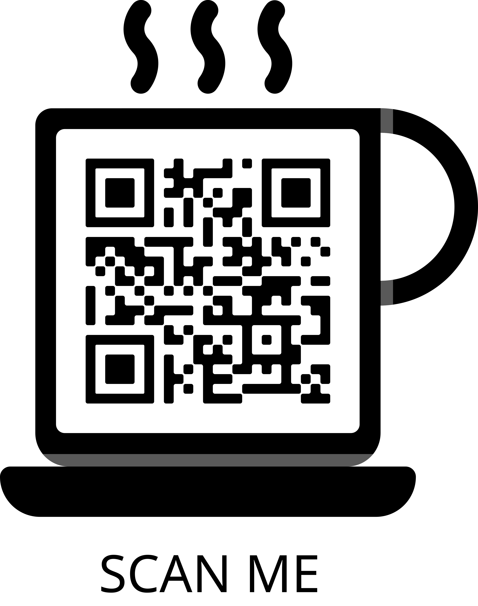

## Projeto realizado durante a Maratona Explorer 3.0 da Rocketseat

  

Esse projeto é a estrutura de um <strong>menu de restaurante</strong> feito utilizando <strong>HTML</strong> e <strong>CSS</strong>. 

#### Para visualizar o menu do RocketCoffee basta <a href="clever-pie-b9f17f.netlify.app">clicar aqui</a> ou escanear o QRcode abaixo com o celular! 

  

O design básico do menu foi fornecido pela Rocketseat via Figma, mas realizei alterações no modelo original, como a adição da logo, imagens e mais seções. 

Té mais!😊

